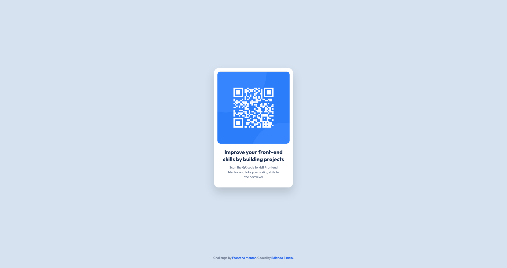

# Frontend Mentor - QR code component solution

This is a solution to the [QR code component challenge on Frontend Mentor](https://www.frontendmentor.io/challenges/qr-code-component-iux_sIO_H).

## Table of contents

- [Overview](#overview)
  - [Screenshot](#screenshot)
  - [Links](#links)
- [My process](#my-process)
  - [Built with](#built-with)
  - [Useful resources](#useful-resources)
- [Author](#author)

## Overview

### Screenshot

### Links

- Solution URL: [Add solution URL here](https://your-solution-url.com)
- Live Site URL: [Add live site URL here](https://your-live-site-url.com)

## My process

### Built with

- Semantic HTML5 markup
- CSS custom properties
- Flexbox
- CSS Grid
- Mobile-first workflow
- [Tailwind CSS](https://tailwindcss.com/) - CSS Framework

**Note: These are just examples. Delete this note and replace the list above with your own choices**

### Useful resources

- [Tailwind Docs](https://tailwindcss.com/docs) - This helped me with alot of the core classes to use in tailwind.

**Note: Delete this note and replace the list above with resources that helped you during the challenge. These could come in handy for anyone viewing your solution or for yourself when you look back on this project in the future.**

## Author

- Website - [Edlando Eliacin](https://www.edlandoeliacin.com)
- Frontend Mentor - [@edlandoe](https://www.frontendmentor.io/profile/Edlandoe)
